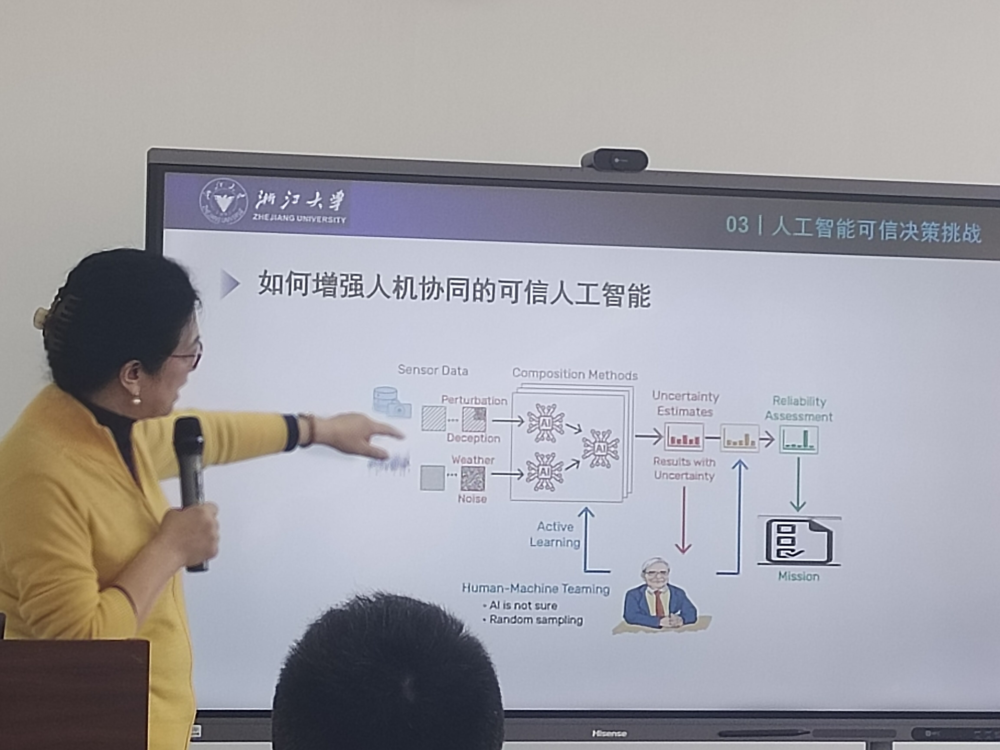
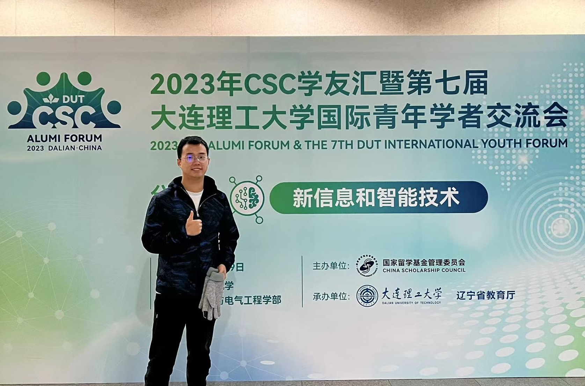

<head>
  
</head>
<body>

  
  
2023-11-11

  
The report by Prof. Xiangwei Kong from ZJU: Trusty AI.

  
  
2023-11-11

  
Attending the 7th DUT international youth forum.

  
  
2023-11-05

  
The report by Prof. Chengqi Zhang from UTS: ChatGPT's impact on AI research and societal development.

</body>
