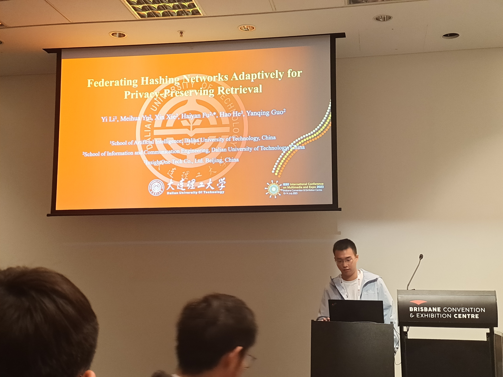
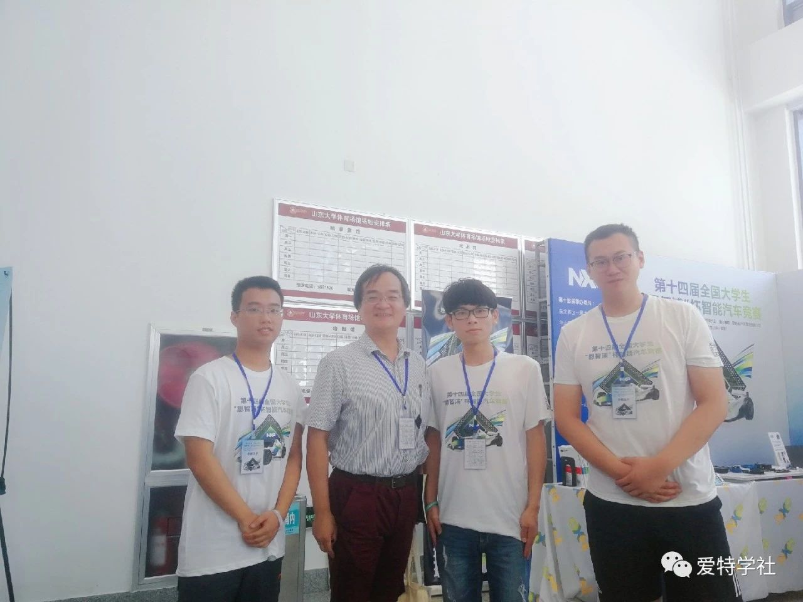

<head>
  
</head>
<body>

  
  
2023-11-11

  
The report by Prof. Xiangwei Kong from ZJU: Trusty AI.

  
  
2023-11-11

  
Attending the 7th DUT international youth forum.

  
  
2023-11-05

  
The report by Prof. Chengqi Zhang from UTS: ChatGPT's impact on AI research and societal development.

  
  
2023-07-12

  
Making the oral presentation at ICME 2023 in Brisbane, AUS.

  
  
2022-08-20

  
As an intern of computer vision at ByteDance in Beijing.

  
  
2019-08-27

  
Participating in the 14th NXP Cup National University Students Intelligent Car Race and taking the photo with the Prof. Qing Zhuo from THU.

</body>
